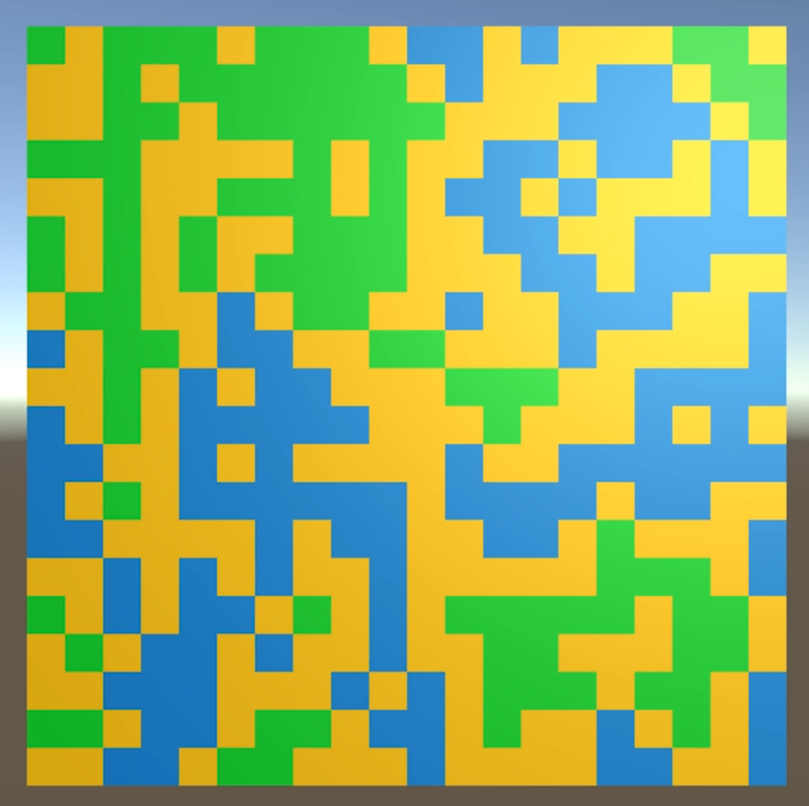
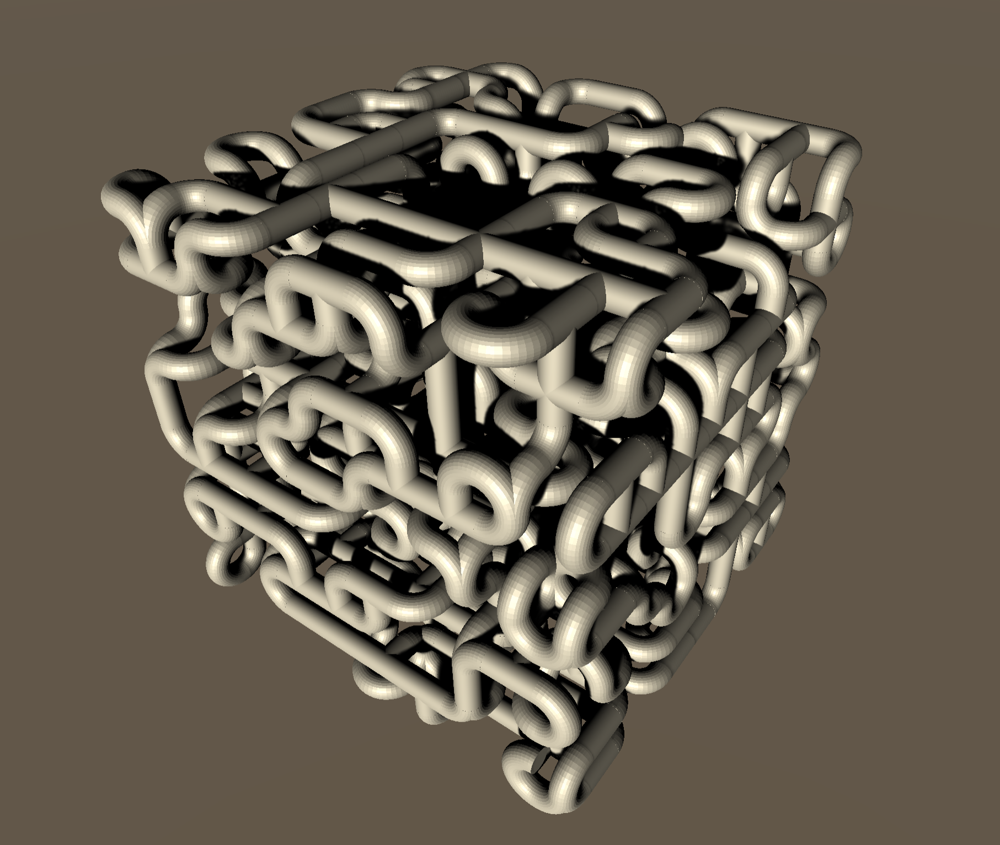
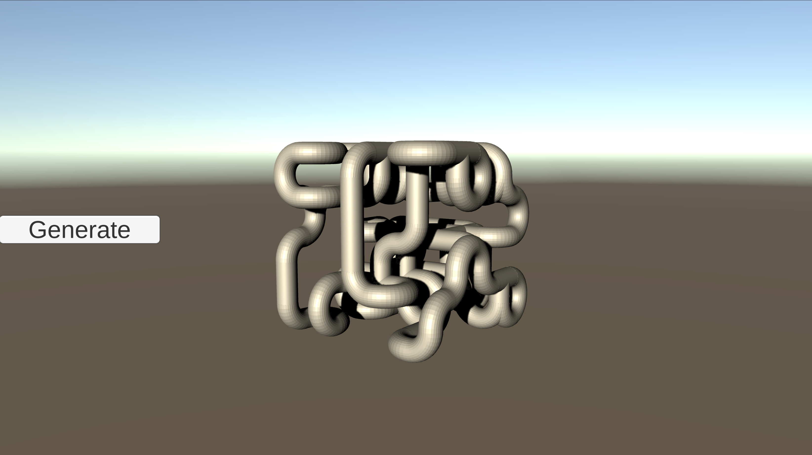

# WFCourse
This repository is part of a Udemy course, currently only in my native language (catalan) https://www.udemy.com/course/unity_wave_function_collapse/
As you can see it is separated into multiple Tags that follow the course steps.

The original wave function collapse algorithm was made by Maxim Gumin, here: https://github.com/mxgmn/WaveFunctionCollapse

The first approach of the algorithm is a simple example of terrain adjacencies (sea, beach, valley, mountain) made of cubes.

Having developed this simple example, we approach a more complex system featuring 3D modules, constraints and backtracking.

And create a UI button in a different scene (following Scriptable Objects event channels pattern), and implement a simple orbital camera.

